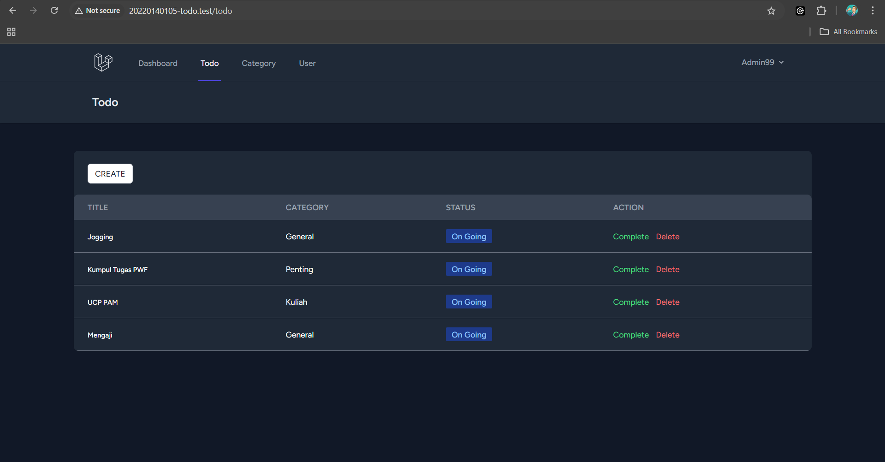
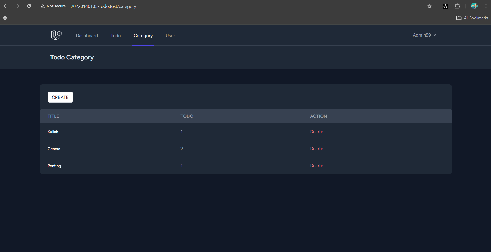
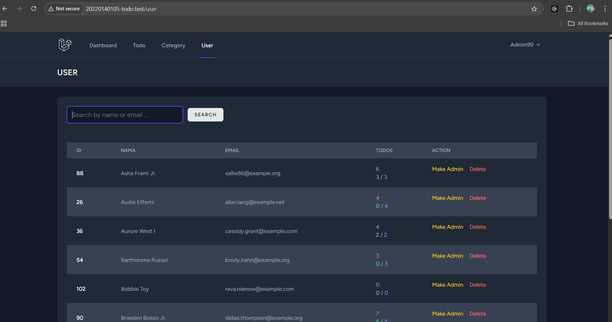

# UCP 1 Praktikum PWF

## 1. Browser Todo http://nim-todo.test/todo
**Deskripsi:** Halaman untuk mengelola daftar todo. Menampilkan daftar todo yang dapat dikelola (ditambah, diubah, dihapus).

    

---

## 2. Browser Category http://nim-todo.test/category
**Deskripsi:** Halaman kategori untuk mengelola kategori-kategori yang tersedia. Setiap kategori dapat dikaitkan dengan todo.

    

---

## 3. Browser User http://nim-todo.test/user 
**Deskripsi:** Halaman untuk mengelola pengguna. Hanya dapat diakses oleh Admin.

    

---
